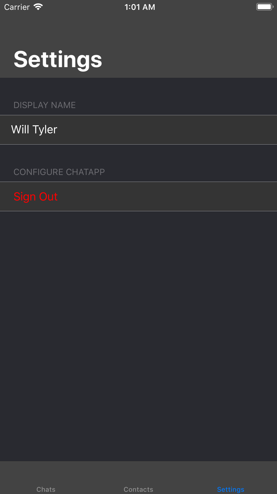
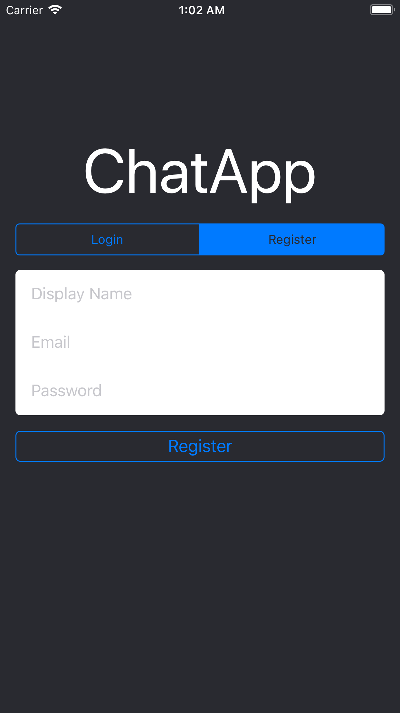
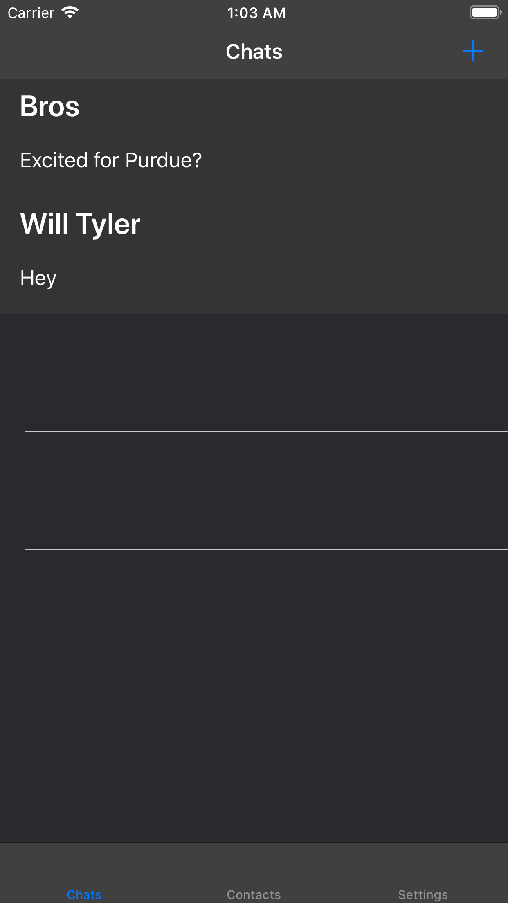
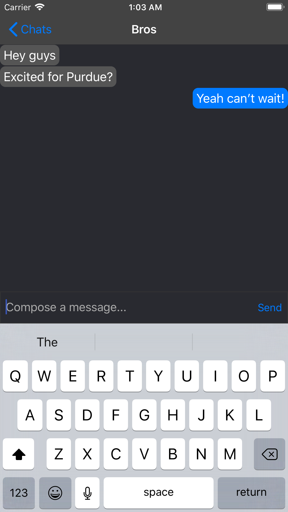

#  ChatApp

An iOS messaging app written with Swift 4.2 and using a Firebase backend.

## Motivation

I worked on this app mostly over 2018 Winter Break in order to work on my Swift and iOS Development skills. I also wanted to become familiar with using Google Firebase, which is a very quick and simple way to kickstart different projects.

## Features

* Sign in and register using email and password.
* Display different chats user is a member of.
* Display user's contacts.
* Users can add contacts via email.
* Settings to allow user to change display name and sign out.
* Create new chat and add members from contacts.
* Send messages to chat.
* Display chat transcript.

## Screenshots

